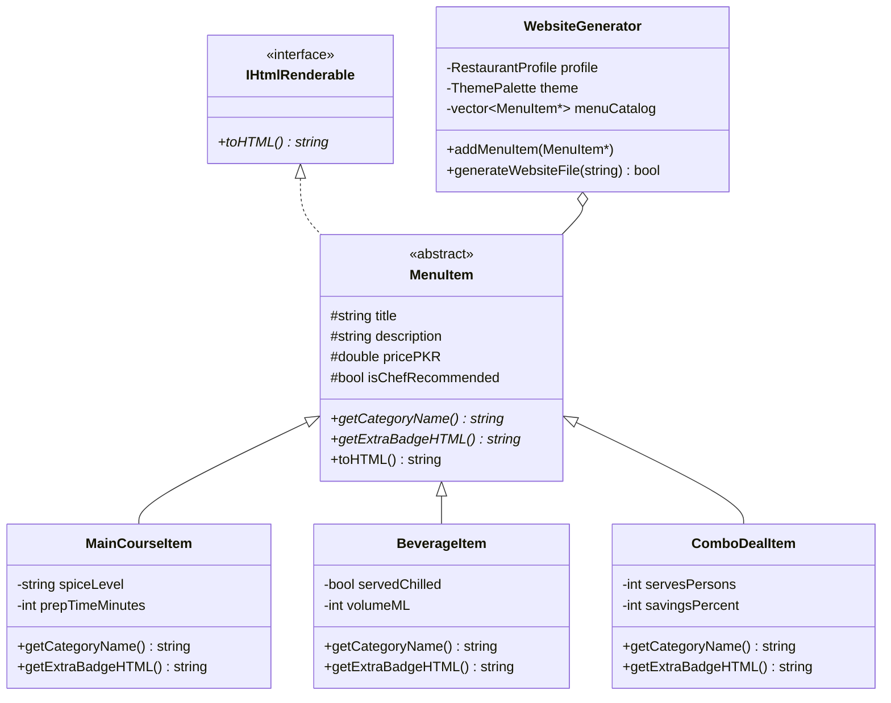

# FoodWebsite Generator — C++ Object-Oriented Programming (OOP)


A C++ **Object-Oriented Website Generator** where users input details about their restaurant or food service (brand metadata, contact info, color theme, and categorized menu offerings), and the program generates a complete, responsive HTML5/CSS3 restaurant website.

🔗 **Live Sample Generated Website:** [https://sohrab-soomro.github.io/food-website-generator-oop/](https://sohrab-soomro.github.io/food-website-generator-oop/)

---

## Object-Oriented Design Architecture



### Core OOP Concepts Applied
1. **Abstraction (`IHtmlRenderable` & `MenuItem`)**: Defines clean abstract contracts (`toHTML()`, `getCategoryName()`, `getExtraBadgeHTML()`) without exposing implementation details.
2. **Inheritance (`MainCourseItem`, `BeverageItem`, `ComboDealItem`)**: Specialized food service classes inherit common pricing/title fields from `MenuItem` while extending category-specific attributes (spice level, volume in ml, group combo savings).
3. **Polymorphism**: `WebsiteGenerator` stores a heterogeneous collection (`vector<MenuItem*>`) and invokes virtual methods at runtime to render tailored HTML cards for each item type.
4. **Encapsulation (`RestaurantProfile` & `ThemePalette`)**: Protects restaurant identity and CSS color tokens inside private class members.

---

## How to Compile & Run

```bash
g++ src/FoodWebsiteGenerator.cpp -o food_web_gen
./food_web_gen
```
